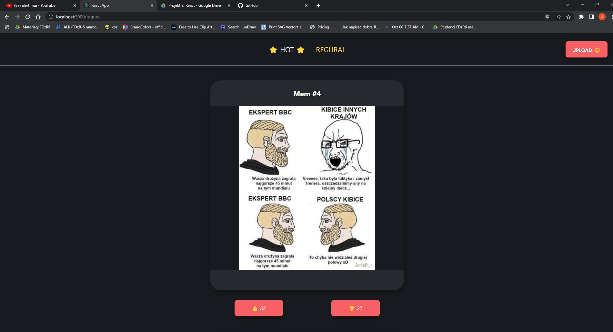
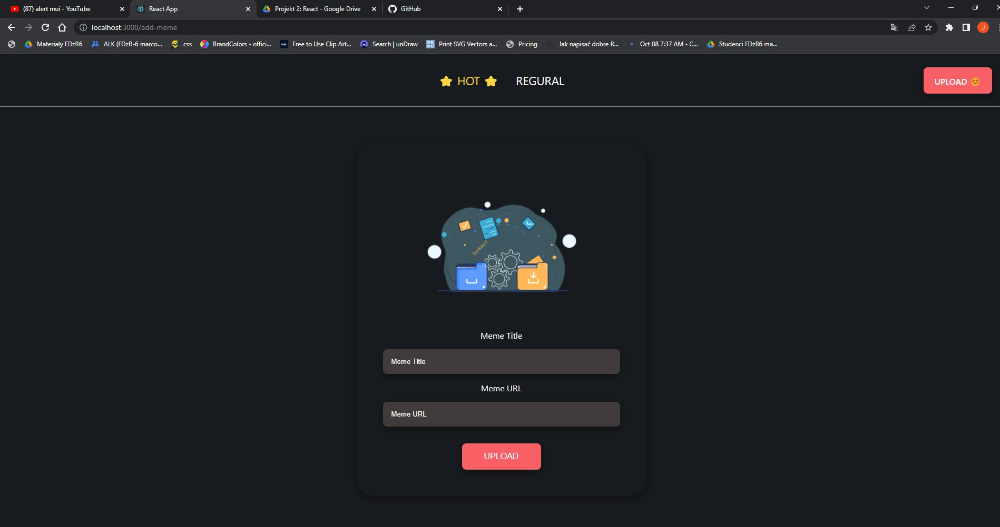

# MEMS 

React Application - meme serwis

Basic functionalities:

- Browse funny pics
- Adding new memes
- Upvoting/Downvoting
- Browsing images divided into hot and regular route

## Setup

    npm install
    npm run start:db
    npm run start:app

## Technologies

- HTML
- CSS, Sass, LESS
- JavaScript ECMAScript 6
- React - version 18.2.0
- React Router - version 6.4.4
- React Redux - version 8.0.5
- MUI - version 5.10.17

## Project Status

Project is: completed

## Demo

